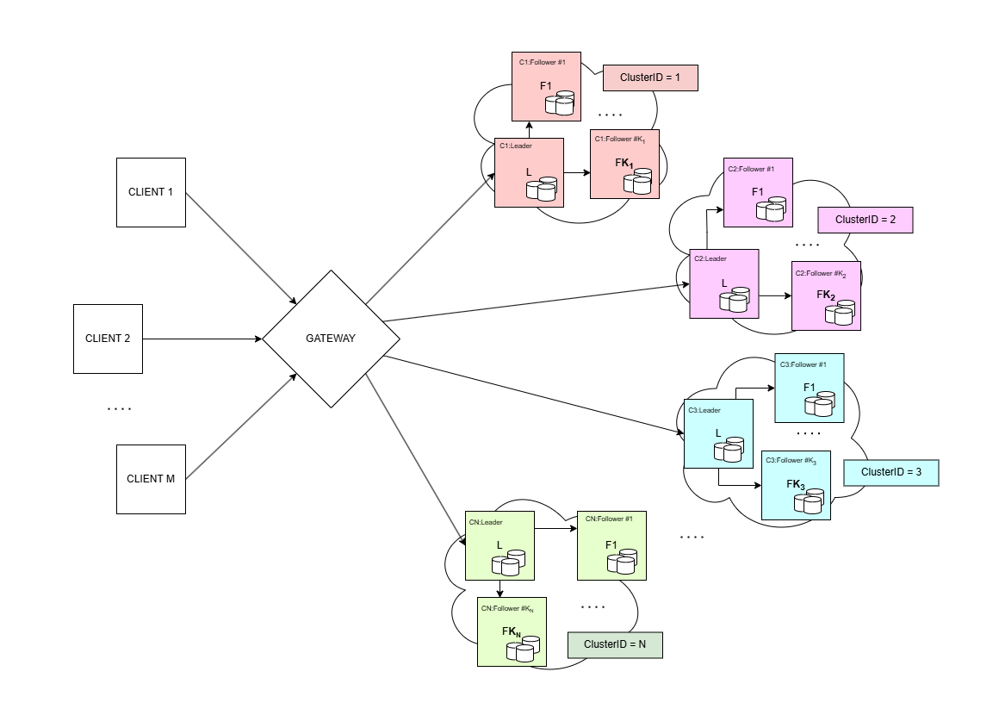

# Reliable Queuing System (DS23)

The **Reliable Queuing System** is a project developed for the **Distributed Systems** course at **Politecnico di Milano** (2023-2024 academic year). The project aims to design and implement a robust, efficient queuing system that operates seamlessly across multiple nodes. It emphasizes core concepts of distributed computing, including fault tolerance, load balancing, and scalability.

## Assignment

Implement a distributed and reliable queuing platform where a set of brokers collaborate to offer multiple queues to multiple clients. Queues are persistent, append only, FIFO data structures. Multiple (not necessarily every) brokers replicate the data of queues to guarantee fault tolerance and high availability in case one of them crashes. Clients connect to brokers to create new queues, append new data (for simplicity assume that queues store integer values) on an existing queue, or read data from a queue. Each client is uniquely identified and the brokers are responsible for keeping track of the next data element each client should read. Investigate and clarify the level of reliability offered by your system.

### Assumptions
- Links between components are reliable.
- Nodes (brokers) may fail due to crash failures.
- Nodes running brokers hold stable storage (i.e., the file system), which can be assumed to be reliable.

---

## Solution Architecture

The solution design consists of three main components: **Client**, **Broker**, and **Gateway**, which are designed to be deployed on different nodes.

### Client

The **Client** is responsible for managing all aspects of user interaction via a command-line interface (CLI). It provides users with a set of operations to interact with the system, including:

- **Creating a new queue**: Allows users to initialize a new queue in the system.
- **Inserting data into an existing queue**: Enables users to add data to a specified queue that has already been created.
- **Reading data from an existing queue**: Allows users to retrieve data from a specified queue, reading in sequence according to the broker's tracking.

### Broker

The **Broker** serves as the core component responsible for managing the business logic of the system. It holds the data model, which is stored in non-persistent memory, encompassing the queues and keeping track of the next unread value for each client.

To allow the client to perform the permitted operations on the data model, the broker exposes a well-defined API. This API allows clients to request queue operations and ensures that each client receives the correct sequence of data according to the system’s logic.

In summary, the data model consists of:
- **All append-only queues** that have been created by the client, each storing data elements in the order they were added (FIFO).
- **A tracking offset** for each client in each queue, indicating the next item to be read, ensuring that each client accesses data sequentially and accurately.

---

## Data Replication

To enhance fault tolerance, this system leverages the **Raft Consensus Algorithm**.

### What is Raft?

Raft is a consensus algorithm designed to enable a group of nodes to operate as a single, reliable system, even in the presence of failures. By implementing a **Leader-Follower** model, Raft coordinates nodes to maintain data consistency and system stability. Here’s a brief overview:

#### Raft Roles:
- **Leader**: The Leader node manages updates, receiving requests that change the system’s state and coordinating with Followers to ensure they are in sync.
- **Followers**: Followers receive state updates from the Leader. This setup helps each node maintain the latest system state.
- **Candidate**: When the Leader fails or becomes unavailable, a Follower can transition to a Candidate and participate in a new Leader election. Only one Candidate becomes the new Leader, ensuring continued system stability.

#### Key Concepts in Raft:
- **Log Consistency**: The Leader ensures that all nodes maintain a consistent log of changes. By replicating state changes to all Followers, Raft guarantees that each node has an identical log, preventing data loss or inconsistencies across nodes.
- **Leader Election**: In the event of a Leader failure, a Leader election process is automatically triggered. Followers nominate themselves as Candidates, and the system elects a new Leader from these Candidates. This process is critical to Raft’s fault tolerance, allowing the system to remain operational even if the original Leader fails.

For more information, see the official [Raft website](https://raft.github.io/).

#### Implemented Version Assumptions:
For simplicity, the current implementation assumes that brokers cannot dynamically join or leave the cluster at runtime. Instead, the number of brokers and their IP addresses must be predefined at startup. The system could be extended to support dynamic broker membership with additional mechanisms for discovery and coordination.

---

## Data Partitioning

To improve scalability and load balancing, queues are distributed across all broker clusters. By partitioning queues in this way, the system can handle higher volumes of requests and evenly distribute the workload among brokers. This setup not only prevents any single broker from becoming a bottleneck but also enables efficient resource utilization across the cluster, enhancing both performance and resilience.

Each broker cluster manages a portion of the queues, allowing for flexible scaling. As the load increases, additional brokers can be introduced to accommodate growing demands, ensuring that the system remains responsive and balanced.

---

## Gateway

The **Gateway** acts as an intermediary between the client and the broker clusters, managing and routing all client requests to the appropriate cluster based on required resources. By centralizing request handling, it simplifies client interactions and hides the system’s internal complexities, including the Raft Consensus Protocol.

#### Key Roles of the Gateway:
- **Load Balancing**: Evenly distributes requests across clusters to optimize resource usage.
- **Fault Tolerance**: Ensures seamless service continuity, masking failover processes and the Raft protocol details.

This design allows clients to interact with a unified, simplified interface, unaffected by the complexities of distributed consensus and cluster management.

#### Gateway Dispatch Rules:

- **Create Queue Request**: Queues are created across broker clusters using a Round Robin approach. This method ensures that queues are evenly distributed among the clusters in a circular fashion. If a cluster becomes unavailable, a new queue is created in the next available cluster in the Round Robin order, maintaining balanced distribution.
  
- **Insert and Read Data into/from the Queue**: Each cluster is assigned a unique identifier ranging from 0 to K, and queues are similarly assigned identifiers starting from 0. Using this setup, the Gateway can determine the location of any queue without storing a specific Queue-Cluster mapping. In an environment with K clusters, the cluster associated with a given `Queue_id` is determined by the formula: `Cluster_id = Queue_id % K`.

### Assumptions:
For this implementation, broker clusters are static and cannot dynamically join or leave the system at runtime. The system requires that the number and configuration of broker clusters be defined prior to startup. To enable this, the Gateway would need to manage a direct Queue-Cluster mapping or implement a queue redistribution strategy, as the formula-based approach would no longer be applicable.

---

